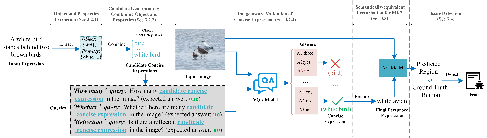

# PEELING


PEELING is an image-aware text perturbation approach for automated testing VG model. It is the first approach to combine image and text information for metamorphosis testing. The core idea is that VG model should locate the original target region on the image if we could find an concise expression which describes the original object and there is no other objects on the image satisfy the description. Specifically, PEELING (1) extracts object and properties from original expression; (2) reorganizes object and properties into candidate concise representations; (3) selects satisfactory concise expressions by understanding the semantics of the image with the help of VQA model; (4) puts concise expression through semantically-equivalent perturbation to generate test suite.



## Datasets and Checkpoints

1. Origin Datasets
 * <a href="https://github.com/OFA-Sys/OFA/blob/main/datasets.md"> Dataset for RefCOCO </a>
 * <a href="https://github.com/OFA-Sys/OFA/blob/main/datasets.md"> Dataset for RefCOCO+ </a>
 * <a href="https://github.com/OFA-Sys/OFA/blob/main/datasets.md"> Dataset for RefCOCOg </a>

2. Our new generated Datasets
 * <a href="https://drive.google.com/file/d/1CZ0TL1k5CjIBwY8uYD16JrEjpkifbSht/view?usp=sharing"> RefCOCO </a>
 * <a href="https://drive.google.com/file/d/1hmypB2rdu4sjsGDFa8ySmOLc3TWsdI9h/view?usp=sharing"> RefCOCO+ </a>
 * <a href="https://drive.google.com/file/d/16Q_bMuJux05vGrP50DuKpqBteqBsleT1/view?usp=sharing"> RefCOCOg </a>

3. Our extracted entity Dataset
 * <a href="https://docs.google.com/spreadsheets/d/1FSQDxa35IEocWwEmfubt8qLiCostpwcc/edit?usp=sharing&ouid=109608198492206193226&rtpof=true&sd=true"> Entities for RefCOCO </a>
 * <a href="https://docs.google.com/spreadsheets/d/1KWV9JhQpm8I-iTt0x-Yf04H6Ge-kFHvQ/edit?usp=sharing&ouid=109608198492206193226&rtpof=true&sd=true"> Entities for RefCOCO+ </a>
 * <a href="https://docs.google.com/spreadsheets/d/1_4TomBy3ckAghbH2pS5XcAORMo74HWWe/edit?usp=sharing&ouid=109608198492206193226&rtpof=true&sd=true"> Entities for RefCOCOg </a>

## Usage

1. Installation
```bash
git clone https://github.com/IMGAT/PEELING.git
pip install -r requirements.txt
```

2. Download datasets and Checkpoints(phrase-bert)
   * download RefCOCO to `data/RefCOCO`

   * download RefCOCO+ to `data/RefCOCO+`

   * download RefCOCOg to `data/RefCOCOg`

   * download <a href="https://huggingface.co/whaleloops/phrase-bert"> phrase-bert </a>

3. Replace "xxx"s with the path to datasets and the path to phrase-best model in `PEELING.py`

4. Run scripts
```bash
   python entity_extraction.py 
   python PEELING.py
```
## Requirements

- python == 3.6.0  

- Jinja2 == 2.11.3  

- numpy == 1.17.4  

- tensorboardX == 1.6  

- tqdm == 4.55.1  

- transformers[sentencepiece] == 4.1.1  

- scikit-learn == 0.24.0  

- spacy == 2.2.4  

- flask == 1.1.2  

- flask-cors == 3.0.10  

- gevent == 21.1.2  

- pillow == 8.2.0  

- pytorch-gpu == 1.7.0  

- torchvision == 0.8.0  

- en_core_web_sm == 2.2.5  

- future == 0.18.2 

- opencv-python

- timm

- ftfy==6.0.3

- pycocotools==2.0.4

- pycocoevalcap==1.2

- pytorch_lightning

- einops

- datasets

- rouge_score

- python-Levenshtein

- zhconv 


